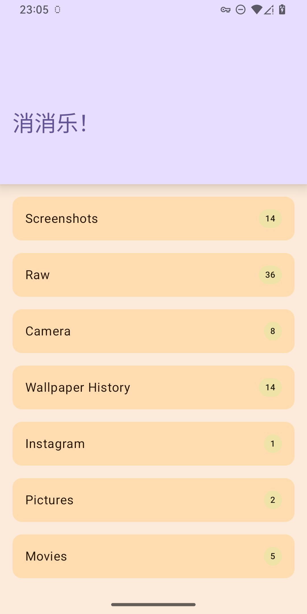
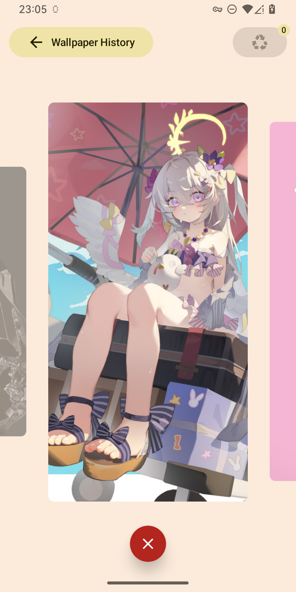
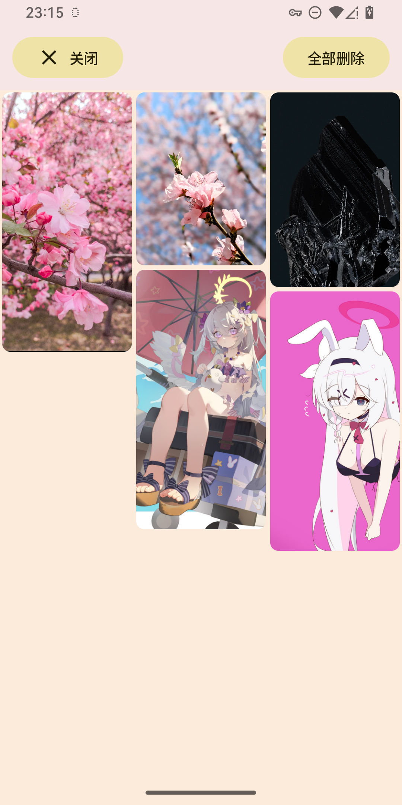

# Oblivionis

> ようこそ。Ave Mujica の世界へ

其实是用来方便删除图片和视频的应用，不管是截图、糊掉的图片、被小朋友/宠物/随便什么原因存下来的东西，其实都是我们回忆的一部分。  
那么删除掉这些图片在某种意义上也会失去部分记忆的载体，因此正好想起来了 Ave Mujica 的 Oblivionis：同样意指忘却。  
  
  
老实来讲本应用受到了 [Slidebox](http://slidebox.co/) 的极大启发，甚至在功能的丰富和稳定程度上都不及 Slidebox。  
造这个轮子除了又是一次练手也是希望能有一个看着更 "Android" 一些的类似应用。  

|  |  |  |
|:-------------:|:-------------:|:-------------:|

  
## 注意
本应用「按原样提供」，由于涉及到对本地数据的读写，请谨慎使用。

## 当前问题
1. 手势功能可能存在问题
2. 手势性能/外观有待优化
3. 设计视频预览的展示性能存在问题
4. 权限设置完成后的检测存在问题，需要退出一次应用