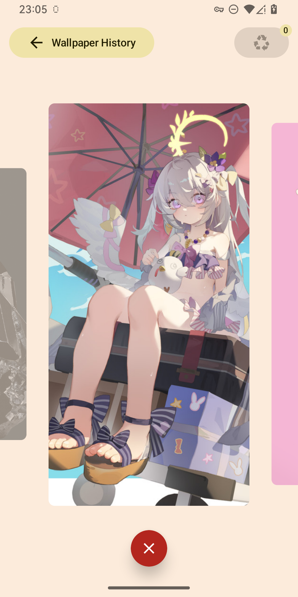

# Oblivionis

> ようこそ。Ave Mujica の世界へ (Welcome to the world of Ave Mujica)

This is an application designed to help you easily delete photos and videos. Whether it's screenshots, blurry photos, or files saved for various reasons, they are all part of our memories. Deleting these media files, in a sense, means losing the carriers of those memories. This reminded me of Ave Mujica's "Oblivionis," which also means "oblivion" or "forgetfulness."

This application is heavily inspired by [Slidebox](http://slidebox.co/). I developed this not only as a personal practice project but also to create a similar tool that feels more like a native Android application in its design.

|  |  |  |
|:---:|:---:|:---:|

## Core Features

* **Album-Based Management**: Browse your media files by album.
* **Mark & Delete**:
    * View each photo or video in a card-style interface.
    * Mark files for the "Recycle Bin" with a simple button tap or an upward swipe gesture.
    * Long-press the delete button to mark all media within the current album for deletion at once.
* **Recycle Bin Mechanism**: All marked files are first moved to a recycle bin, giving you a chance to review them before permanent deletion, preventing accidental loss.
* **Exclude Important Files**: For important media that you don't want to be affected by the "delete all" action, you can swipe down to mark them as "excluded."
* **Periodic Cleanup Reminders**:
    * Set up scheduled notifications to remind you to clean up your media library regularly.
    * Customize the notification interval (e.g., 1 day, 15 days, 30 days) and the specific time of day.

## Disclaimer

This application is provided **"AS IS"**. As it involves reading and deleting local data, please use it with **CAUTION**.

## Permissions Required

* **Read Media Files**: Required to discover and display the photos and videos on your device.
* **Manage Media Files (Optional)**: Granting this permission allows the app to delete files without a second system confirmation, providing a smoother experience.
* **Post Notifications (Optional)**: Required if you wish to use the periodic cleanup reminder feature.

## Current Issues

1.  The swipe gesture for deletion may have stability and sensitivity issues.
2.  The performance and visual feedback of gestures need optimization.
3.  Video preview loading performance may be an issue when dealing with many videos.
4.  Periodic notifications may not always fire at the expected time and frequency.
5.  Other potential undiscovered issues.